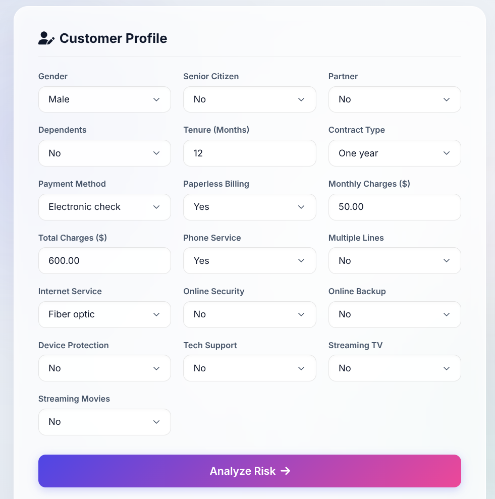
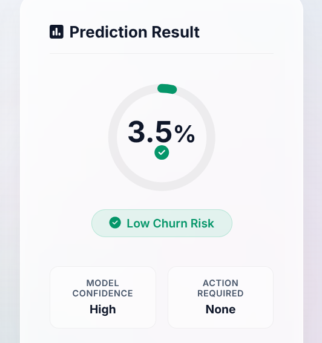

# Telecom Customer Churn Prediction

## Overview
Customer Behaviour Analyzer is an advanced machine learning web application designed to help telecommunications companies proactively identify customers at risk of leaving. The project leverages an XGBoost classifier to compute a precise churn probability score based on 31 distinct customer features, encompassing demographic data, account information, and subscribed services.

## Features
- **Predictive Analytics:** Accurately forecasts customer churn probability.
- **Risk Stratification:** Categorizes customers into three actionable risk tiers:
  - Low Risk (< 30%)
  - Moderate Risk (30% - 69%)
  - High Risk (>= 70%)
- **Premium Web Interface:** A highly responsive, modern UI built with glassmorphism design principles, dynamic background animations, and real-time visual feedback.
- **End-to-End Pipeline:** Includes the complete data preprocessing, feature engineering, model training, and a Flask-based deployment server.

## Demo

**Customer Profile Input**  


**Prediction Result & Risk Analysis**  


## Dataset
The model was trained on the Telco Customer Churn dataset.
Dataset Link: [Kaggle - Telco Customer Churn](https://www.kaggle.com/datasets/blastchar/telco-customer-churn)

## Project Structure
- `app.py`: The Flask backend serving the API and rendering the frontend.
- `telecom.ipynb`: The Jupyter Notebook containing data analysis, preprocessing, and model training.
- `churning_customer.pkl`: The serialized XGBoost classifier model.
- `templates/index.html`: The frontend HTML structure.
- `static/css/style.css`: The CSS stylesheet for the premium light theme.

## Installation & Usage

1. **Clone the repository:**
   ```bash
   git clone https://github.com/punitxdev/telecom_customer_churn_prediction.git
   cd telecom_customer_churn_prediction
   ```

2. **Create a virtual environment and install dependencies:**
   ```bash
   python -m venv venv
   source venv/bin/activate
   pip install flask pandas xgboost scikit-learn joblib
   ```

3. **Run the Flask application:**
   ```bash
   python app.py
   ```

4. **Access the application:**
   Open a web browser and navigate to `http://127.0.0.1:5001`.

## Technologies Used
- **Backend:** Python, Flask
- **Machine Learning:** XGBoost, Scikit-Learn, Pandas
- **Frontend:** HTML, Vanilla CSS, JavaScript
